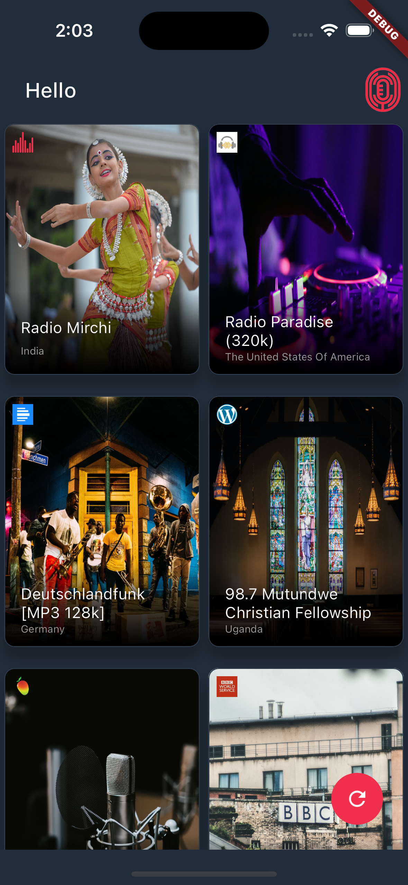
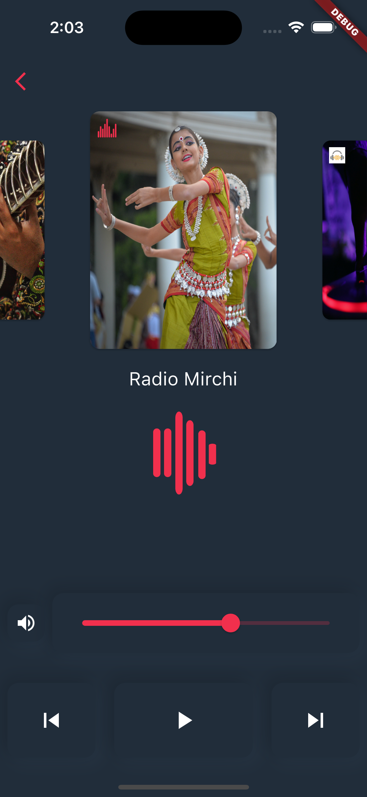

# RadioPlayer App

**RadioPlayer App** is a mobile application developed in Flutter that allows you to listen to the top 20 most clicked radio stations according to Radio Browser. Enjoy a variety of radio stations from around the world all in one place.

## Screenshots

 | 

## Features

- Play the top 20 most clicked radio stations.
- Select a radio station and listen in real-time.
- Intuitive and user-friendly interface.
